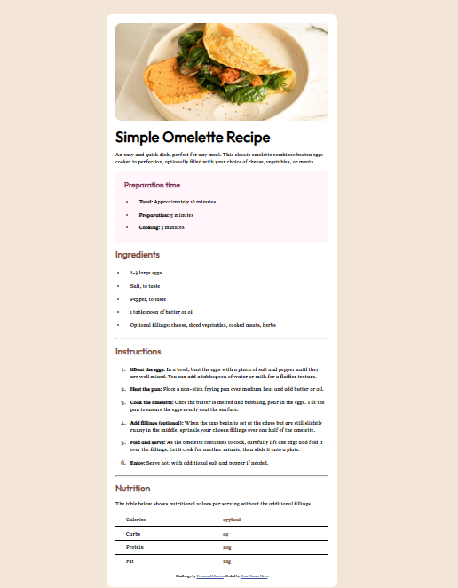

# Frontend Mentor - Recipe page solution

  Esta é uma solução feita para o [desafio da página de receitas no Frontend Mentor](https://www.frontendmentor.io/challenges/recipe-page-KiTsR8QQKm).

## Table of contents

- [Overview](#overview)
  - [The challenge](#the-challenge)
  - [Screenshot](#screenshot)
  - [Links](#links)
- [My process](#my-process)
  - [Built with](#built-with)
  - [What I learned](#what-i-learned)
  - [Continued development](#continued-development)
  - [Useful resources](#useful-resources)
- [Author](#author)
- [Acknowledgments](#acknowledgments)

**Note: Delete this note and update the table of contents based on what sections you keep.**

## Overview

### Screenshot



  

### Links

- Solução URL: [URL da solução](https://github.com/Luanpierote/projects)

## My process

### Built with

- HTML5 semântico
- Propriedades personalizadas de CSS
- Flexbox
- Desktop-first workflow

### What I learned

Nesta atividade, eu aprendi a como reutilizar apropriadamente os mesmos elementos de estilo, para diferentes propósitos dentro da minha aplicação e à estilizar o conjunto de elementos exatos do meu html. Além de ajustar a página, responsivamente, para outros tipos de telas( como mobile ), aproveitando de ferramentas nativas como Media queries CSS. 
Na area do HTML, tive o prazer de aprender a estilizar as tabelas da forma que achei mais apropriado.

Para ver como eu implementei essas soluções no programa:

```css
  body {
      display: flex;
      flex-wrap: wrap;
      justify-content: center;
      align-items: center;
      /* tirei o heigh: 100vh */
      background-color: hsl(30, 54%, 90%);
      font-family: "YoungSerif", serif;
      padding-top: 100px;
      margin-bottom: 100px;
    }
     @media (max-width: 500px) {
      body {
        padding-top: 0;
        margin-bottom: 0;
      }
    }
  
   ol li::marker {
      /*Colorindo apenas os números*/
      color: hsl(14, 45%, 36%);
      font-size: 18px;
      font-weight: 600;
    }
```

```html
<table style="border-collapse:collapse; width: 100%;">
        <tr>
          <td style=" padding-left: 5%">Calories</td>
          <td style="text-align: left;color: hsl(14, 45%, 36%);font-weight:bolder">277kcal</td>
        </tr>

        <tr style="border-top: 1px solid black;">
          <td style=" padding-left: 5%">Carbs</td>
          <td style="text-align: left;color: hsl(14, 45%, 36%);font-weight:bolder">0g</td>
        </tr>

        <tr style="border-top: 1px solid black;">
          <td style=" padding-left: 5%">Protein</td>
          <td style="text-align: left;color: hsl(14, 45%, 36%);font-weight:bolder">20g</td>
        </tr>

        <tr style="border-top: 1px solid black;">
          <td style="padding-left: 5%">Fat</td>
          <td style="text-align: left;color: hsl(14, 45%, 36%);font-weight:bolder">22g</td>
      </table>
    </section>
  ```

### Continued development

Quero poder refatorar o meu código usando componentes reutilizáveis; padroniziar um método de desenvolvimento para acelerar o processo de modelagem do site, e apenas me preocupar com problemas futuros; masterizar métodos de produção de websites responsivos. E através de funções JavaScript, aplicar funcionalidades muito mais atraentes,criativas, visando agradar a experiência do usuário ao máximo.

### Useful resources

- [Recurso-1](https://www.youtube.com/watch?v=sSkmBxsaJWg&t=65s) - Essa video aula me ajudou a entender como padrões Flexbox funcionam na prática.

## Author

- Website - [Luan](https://luanpierote.netlify.app/)
- Frontend Mentor - [@Luanpierote](https://www.frontendmentor.io/profile/Luanpierote)

## Acknowledgments

Gostaria de expressar meus agradecimentos ao Frontend Mentor por fornecer estes desafios práticos e recursos gratuitos, que permitem aos desenvolvedores testar e aprimorar suas habilidades de programação de maneira estruturada e eficiente.

