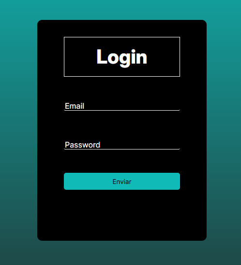

<h1 align="center">Login — Projeto Pessoal </h1>

  Este projeto foi criado para praticar e demonstrar meus conhecimentos sobre o modelo Cliente-Servidor. Ele simula um sistema de autenticação simples, no qual o cliente envia as credenciais para o servidor, que responde com um token de acesso, representando uma troca real entre front-end e back-end.

## Table of contents

- [Overview](#overview)
  - [Screenshot](#screenshot)
- [My process](#my-process)
  - [Built with](#built-with)
  - [What I learned](#what-i-learned)
  - [Continued development](#continued-development)
- [Author](#author)


    A implementação consiste em um sistema simples de autenticação, que simula a geração de token a partir dos dados de usuários fictícios, armazenados por um array de objetos. 
    A solução percorre esse array para validar as credenciais na interface de Login, envia esses dados para o servidor,que então cria o token e executa o processo de validação.
    Por fim, a operação é concluída com sucesso, demonstrando o fluxo de comunicação entre Cliente e Servidor por meio de uma API Rest.

## Overview

### Screenshot



## My process

    **➤Instruções para testar a aplicação**

**Clonar o repositório / abrir a pasta no VSCode**

    No repositório Git:

    ```bash
 git clone <URL-DO-REPOSITORIO>
 cd <NOME-DA-PASTA>
 code .
    ```

**Instalar dependências**

    No terminal do VSCode, dentro da pasta do projeto:

    ```bash
 npm install express dotenv jsonwebtoken
    ```

**Iniciar o servidor**

Use o comando que você informou:

    ```bash
 npm run watch
    ```

    Depois abra o navegador e acesse:
   [http://localhost:3000](http://localhost:3000)

 ## ➢ Credenciais de Teste

 | Nome de Usuário        | Senha  |
 |------------------------|--------|
 | `andre`                | `1234` |
 | `patricia`             | `1234` |
 | `andressa`             | `1234` |

### Built with

- HTML5 
- CSS3
- JavaScript (ES6 Modules)
- JSON Web Token
- Express
- Manipulação de DOM
- Organização em classes e módulos
- Propriedades personalizadas CSS
- Desktop-first workflow

### What I learned

Durante o desenvolvimento dessa API, aprimorei minha capacidade de estruturar fluxos lógicos em JavaScript, explorando conceitos fundamentais como autenticação de usuários, geração e validação de tokens JWT e controle de estado da interface por meio do `localStorage`. Também aprofundei meus conhecimentos em manipulação de módulos nativos do JavaScript, aplicando técnicas de serialização de strings, conversão de valores e objetos, além do uso de métodos de criptografia e hashing de senhas. Esse projeto me proporcionou uma compreensão mais sólida sobre o funcionamento de sistemas de autenticação e sobre como implementar, de forma organizada, a comunicação entre cliente e servidor em uma API REST.

Exemplos de soluções que implementei no programa:

```js
    router.get("/validacao",(req,res) =>{
    const autHeader = req.headers['authorization'];
    const token = autHeader && autHeader.split(' ')[1];

    if(!token)return res.status(403).json({error: "não autorizado, não achei o token"});

    jwt.verify(token,SECRET,(err,nome)=>{
        if(err)return res.status(403).json({error: "não autorizado, na verificação"});

        res.json({message:"acesso autorizado",nome})

    });
});
```


### Continued development

Pretendo continuar aprimorando o projeto com a integração de um sistema de persistência de dados, permitindo armazenar e consultar informações de autenticação de forma dinâmica. Além disso, planejo implementar um painel administrativo para gerenciamento de usuários. Por fim, pretendo refinar essa aplicação para utilizá-la como uma base sólida para o desenvolvimento de outros sistemas, aproveitando sua estrutura modular e reutilizável.

## Author

- Website - [Luan](https://luanpierote.netlify.app/)
- GitHub - [@Luanpierote](https://github.com/LuanPierote)


