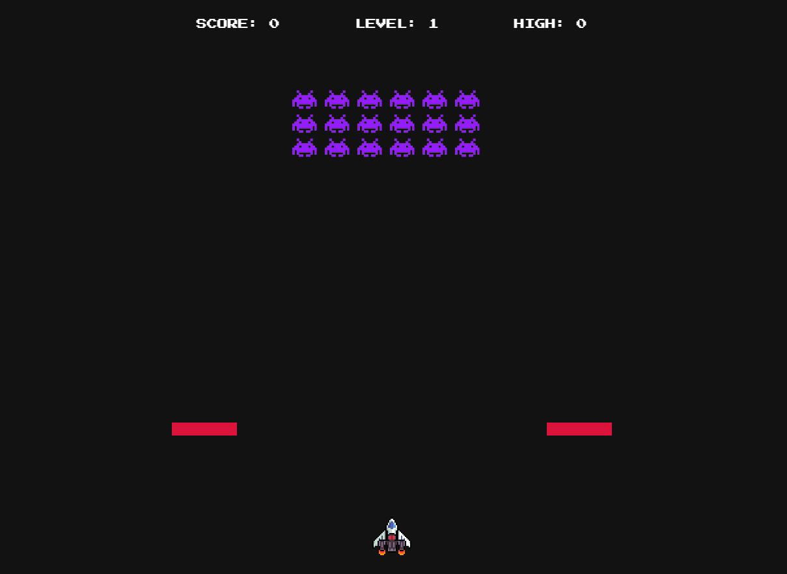

# 🎮 Space Invaders — Projeto Pessoal

  Este é um projeto pessoal desenvolvido com base nos aprendizados obtidos através do canal [Manual do Dev](https://www.youtube.com/@ManualdoDev), que foi fundamental para minha evolução e compreensão prática de lógica de jogos em JavaScript.

## Table of contents

- [Overview](#overview)
  - [The challenge](#the-challenge)
  - [Screenshot](#screenshot)
  - [Links](#links)
- [My process](#my-process)
  - [Built with](#built-with)
  - [What I learned](#what-i-learned)
  - [Continued development](#continued-development)
  - [Useful resources](#useful-resources)
- [Author](#author)
- [Acknowledgments](#acknowledgments)

Space Invaders é uma recriação moderna do clássico jogo de arcade.
Neste projeto, implementei a movimentação do jogador, geração de inimigos, detecção de colisões, efeitos de partículas e sistema de pontuação — tudo utilizando JavaScript puro, HTML5 Canvas e CSS.

O projeto é totalmente interativo e contém elementos como:

    - Tela inicial e de game over;

    - Registro de jogador;

    - Sistema de níveis progressivos;

    - Sons e efeitos visuais.


## Overview

### Screenshot




### Links

- 🎮 Jogue agora:[URL do Site](https://mitoconriainvaders.vercel.app/)

## My process

### Built with

- HTML5 Canvas
- CSS3
- JavaScript (ES6 Modules)
- Manipulação de DOM
- Organização em classes e módulos
- Propriedades personalizadas CSS
- Desktop-first workflow

### What I learned

Durante o desenvolvimento do Space Invaders, aprimorei minha capacidade de estruturar lógicas complexas em JavaScript, explorando conceitos fundamentais como ciclos de jogo com `requestAnimationFrame()`, detecção de colisões entre objetos e partículas, e modularização do código com classes e imports/exports. Também aprofundei meus conhecimentos na manipulação do Canvas, aplicando técnicas para renderização de sprites, criação de efeitos visuais e controle de estados do jogo, como start, playing e game over. Esse projeto me proporcionou uma compreensão mais sólida sobre o funcionamento interno de jogos 2D e sobre como traduzir ideias abstratas em sistemas interativos bem organizados.

Exemplos de soluções que implementei no programa:

```js
  const checkShootInvaders = () => {
  grid.invaders.forEach((invader, invaderIndex) => {
    playerProjectiles.some((projectile, projectileIndex) => {
      if (invader.hit(projectile)) {
        soundEffects.playHitSound();
        createExplosion({
          x: invader.position.x + invader.width / 2,
          y: invader.position.y + invader.height / 2,
        }, 10, "#941cff");
        incrementScore(10);
        grid.invaders.splice(invaderIndex, 1);
        playerProjectiles.splice(projectileIndex, 1);
      }
    });
  });
};
```

```js
const gameOver = () => {
    createExplosion({ //gerando particulas ao acertar o player
        x: player.position.x + player.width / 2,
        y: player.position.y + player.height / 2,
    },
        10,
        "white"
    );
    createExplosion({ //gerando particulas ao acertar o player
        x: player.position.x + player.width / 2,
        y: player.position.y + player.height / 2,
    },
        10,
        "#4d9be6"
    );
    createExplosion({ //gerando particulas ao acertar o player
        x: player.position.x + player.width / 2,
        y: player.position.y + player.height / 2,
    },
        10,
        "crimson"
    );

    currentState = GameState.GAME_OVER;
    player.alive = false;
    playerLifes --;
    if(playerLifes < 2 && playerLifes > 0){
        registerScreen.classList.add("active")
         document.body.append(registerScreen); 
    }else{
    document.body.append(gameOverScreen);
    }
}
  ```

### Continued development

Pretendo continuar aprimorando o projeto com a implementação de um ranking online de jogadores, a fim de introduzir persistência de dados e interação entre diferentes sessões. Além disso, desejo refinar a interface visual para torná-la mais intuitiva e responsiva, aprimorar as animações de entrada dos inimigos e criar um design mais único para os personagens, oferecendo uma experiência mais dinâmica e envolvente. Também planejo aumentar o nível de dificuldade do jogo adicionando novos inimigos mais desafiadores, mantendo, porém, a essência original da gameplay que torna o Space Invaders cativante e acessível.

### Useful resources

- [Canal Manual do Dev](https://www.youtube.com/@ManualdoDev) - onteúdo prático e direto, que me ajudou a entender a estruturação e modularização de jogos em JavaScript.

## Author

- Website - [Luan](https://luanpierote.netlify.app/)
- GitHub - [@Luanpierote](https://github.com/LuanPierote)

## Acknowledgments

Agradeço especialmente ao canal [Manual do Dev](https://www.youtube.com/@ManualdoDev) pelo conteúdo didático e objetivo, que foi essencial para o meu progresso e para a realização deste projeto.

